# Manual do Usuário — Bússola Financeira

**Versão do app:** v0.10 (beta) · **Atualizado em:** maio/2026

---

## Sumário

1. [O que é o Bússola Financeira](#1-o-que-é-o-bússola-financeira)
2. [Primeiros passos](#2-primeiros-passos)
3. [Painel](#3-painel)
4. [Movimentações financeiras](#4-movimentações-financeiras)
5. [Reembolsos](#5-reembolsos)
6. [Pedidos de pagamento](#6-pedidos-de-pagamento)
7. [Configurações](#7-configurações)
8. [Papéis e permissões](#8-papéis-e-permissões)
9. [Projetos e Relatórios](#9-projetos-e-relatórios)
10. [Perguntas frequentes](#10-perguntas-frequentes)
11. [Histórico de versões](#11-histórico-de-versões)

---

## 1. O que é o Bússola Financeira

O Bússola Financeira é uma plataforma de gestão financeira desenvolvida pela RIT — Rede de Inovação e Transformação — para organizações da sociedade civil (OSCs) do terceiro setor.

O sistema foi criado para simplificar o dia a dia de tesoureiros, presidentes, coordenadores e voluntários que precisam acompanhar receitas, despesas, reembolsos e pagamentos com clareza e rastreabilidade.

**Para quem é:**
- **Tesoureiro:** gestão completa das movimentações, aprovação de pagamentos, exportação de dados
- **Presidente/Dirigente:** aprovação de reembolsos e pedidos de pagamento, visão geral das finanças
- **Coordenador de projeto:** solicitação de reembolsos e pedidos de pagamento vinculados a projetos
- **Voluntário:** solicitação de reembolsos por despesas realizadas em atividades da organização

**Acesse em:** [bf.rit.org.br](https://bf.rit.org.br)

---

## 2. Primeiros passos

### Acesso à plataforma

O acesso ao Bússola é feito por convite. Quando o administrador da sua organização cadastra você no sistema, você recebe um e-mail com um link de configuração de conta.

[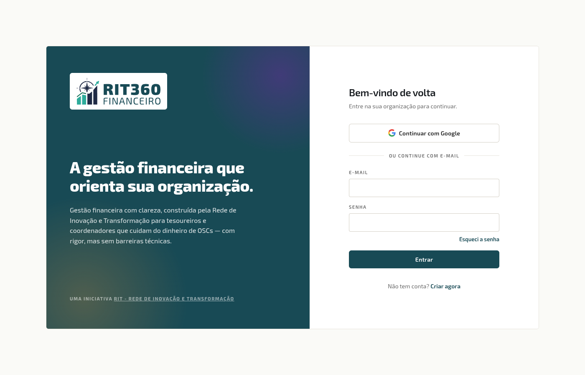](assets/screenshots/manual-00-login.png)
*Tela de login — v0.10 (beta)*

Na tela de login você pode:
- Entrar com **e-mail e senha** (credenciais definidas no primeiro acesso)
- Entrar com **Continuar com Google** (se você configurou sua conta via Google no primeiro acesso)

### Primeiro acesso (via convite)

1. Abra o e-mail de convite enviado pelo administrador da sua organização
2. Clique no link "Configurar minha conta"
3. Preencha seu nome completo e defina uma senha (mínimo 8 caracteres, com letras maiúsculas, minúsculas, números e símbolos) — ou escolha "Continuar com Google"
4. Leia e aceite a Política de Privacidade
5. Clique em "Concluir"

Após o primeiro acesso, você será redirecionado diretamente para o **Painel** da sua organização.

### Aceite da política de privacidade

Na primeira vez que você acessa o sistema, ou quando a política é atualizada, aparece uma tela solicitando a leitura e o aceite da Política de Privacidade. Este passo é obrigatório para usar o sistema.

### Navegação principal

A barra de navegação no topo da tela dá acesso a todos os módulos:

| Item de menu | O que é |
|---|---|
| **Painel** | Visão geral de saldos e atividade recente |
| **Movimentações** | Receitas, despesas e transferências |
| **Pagamentos e Reembolsos** | Pedidos de pagamento e reembolsos |
| **Projetos** | Gestão de projetos *(em breve)* |
| **Relatórios** | Relatórios gerenciais *(em breve)* |
| **Configurações** | Perfil, usuários, contas, categorias |

No canto superior direito ficam: o botão de **Feedback**, o seletor de **organização ativa**, o botão de **Superadmin** (apenas para administradores de plataforma), as **notificações** e o **avatar** do usuário.

---

## 3. Painel

[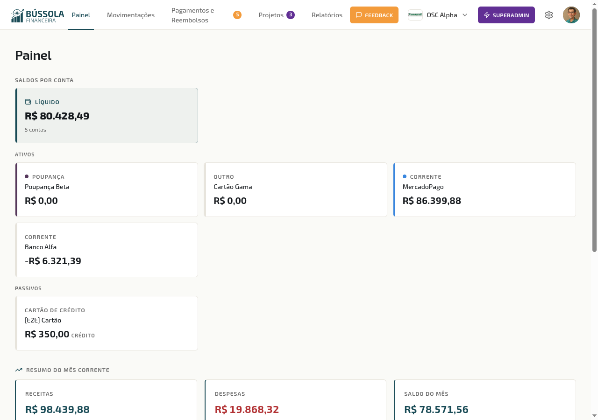](assets/screenshots/manual-01-dashboard.png)
*Painel principal — v0.10 (beta)*

O Painel é a primeira tela após o login. Ele apresenta:

### Saldos por conta

Cada conta financeira da organização (conta corrente, poupança, cartão, etc.) aparece com seu **saldo atual**. O saldo é calculado automaticamente com base em todas as movimentações lançadas e marcadas como pagas.

No rodapé do bloco aparece o **saldo consolidado** de todas as contas ativas.

### Cards de reembolsos

Dependendo do seu papel, você vê cards diferentes:
- **Meus reembolsos pendentes** (rascunhos e rejeitados aguardando reenvio) — *todos os papéis*
- **Aguardando minha aprovação** — *Presidente e Tesoureiro*
- **Aguardando pagamento** — *Tesoureiro*

### Cards de pedidos de pagamento

Semelhante aos reembolsos:
- **Aguardando minha aprovação** — *Presidente e Tesoureiro*
- **Aprovados aguardando pagamento** — *Tesoureiro*
- **Solicitado por mim** — *todos os papéis*

Clicar em qualquer card leva diretamente à lista filtrada pelo status correspondente.

---

## 4. Movimentações financeiras

O módulo de **Movimentações** é o coração do sistema. Aqui ficam registradas todas as receitas, despesas e transferências da organização.

### Lista de movimentações

[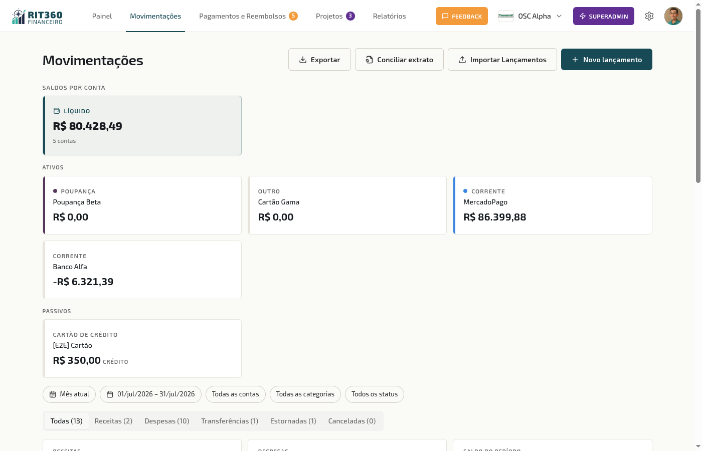](assets/screenshots/manual-02-movimentacoes-lista.png)
*Lista de movimentações com filtros ativos — v0.10 (beta)*

A lista mostra todas as movimentações com as colunas: **Vencimento**, **Pagamento**, **Lançamento** (título e beneficiário), **Conta**, **Categoria**, **Status** e **Valor**.

**Status possíveis:**
- 🟡 **Pendente** — lançado, ainda não pago, dentro do prazo
- 🔴 **Atrasado** — data de vencimento passou sem pagamento
- 🟢 **Pago** — confirmado como pago
- ⚪ **Estornado** — movimento desfeito (o valor foi revertido)
- ⬛ **Cancelado** — lançamento cancelado manualmente

#### Abas por tipo

A lista tem abas para filtrar por tipo: **Todas**, **Receitas**, **Despesas**, **Transferências**, **Estornadas** e **Canceladas**.

Na barra inferior de cada aba aparecem os **totais**: receitas, despesas e saldo do período filtrado.

#### Filtros

Você pode filtrar por:
- **Período** (padrão: mês corrente — atenção: ao abrir a tela, só o mês atual aparece)
- **Conta**
- **Categoria**
- **Status**

Quando há filtros ativos, uma linha discreta "Filtrado por: …" aparece abaixo dos totais. O botão **Limpar filtros** remove todos os filtros de uma vez.

> 💡 Para ver movimentações de períodos anteriores, clique no filtro de **Período** e selecione o intervalo desejado.

#### Ordenação

Clique no cabeçalho de qualquer coluna (Vencimento, Pagamento, Status, Valor, Categoria) para ordenar. Um segundo clique inverte a ordem; um terceiro remove a ordenação.

#### Ações por linha

Cada linha tem ícones de ação no final:
- ✏️ **Editar** — disponível para movimentações pendentes ou atrasadas
- ✕ **Cancelar** — disponível para pendente e atrasado
- ↩ **Estornar** — disponível para movimentações pagas
- 🗑 **Excluir** — disponível para canceladas e estornadas

#### Seleção em lote

Marque o checkbox no início de cada linha para selecionar múltiplas movimentações. A **barra de ações em lote** aparece no rodapé com as opções: **Marcar como pago** e **Excluir**.

#### Exportação

O botão **Exportar** no topo da lista permite exportar para:
- **PDF** — relatório formatado com cabeçalho, filtros ativos e totais
- **Excel** — planilha com todas as colunas para análise

### Detalhe de uma movimentação

[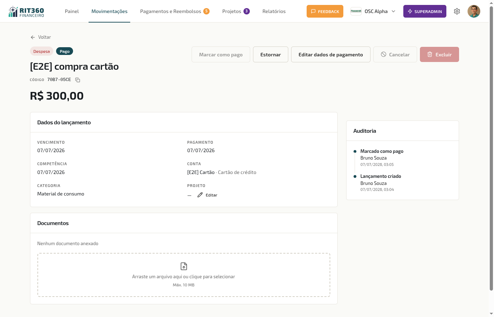](assets/screenshots/manual-03-movimentacao-detalhe.png)
*Detalhe de uma despesa — v0.10 (beta)*

Clique em qualquer linha da lista para abrir o detalhe completo. Você verá:

- **Tipo e status** (chips coloridos no topo)
- **Título e valor** em destaque
- **Dados do lançamento**: vencimento, competência, conta, categoria, beneficiário/fornecedor, forma de pagamento
- **Documentos**: comprovantes e notas fiscais anexados
- **Auditoria**: data de criação e nome de quem lançou

No detalhe de uma movimentação **pendente ou atrasada**, você tem os botões:
- **Editar** — abre o formulário de edição
- **Marcar como pago** — registra a data de pagamento
- **Estornar** — para movimentações já pagas
- **Cancelar** — cancela o lançamento com um motivo
- **Excluir** — remove definitivamente (apenas canceladas/estornadas)

### Registrar novo lançamento

[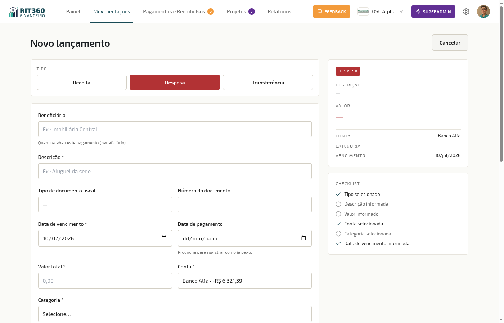](assets/screenshots/manual-04-novo-lancamento.png)
*Formulário de novo lançamento — v0.10 (beta)*

Clique em **+ Novo lançamento** no topo da lista para registrar um lançamento.

**Campos obrigatórios:**
- **Tipo**: Receita, Despesa ou Transferência
- **Título**: descrição breve do lançamento
- **Data de vencimento**
- **Valor total**
- **Conta**
- **Categoria** (não obrigatória para Transferências)

**Campos opcionais:**
- **Data de pagamento** — se preenchida, o lançamento já é salvo como "Pago"
- **Projeto**
- **Centro de custo**
- **Distribuir valor entre categorias** — permite dividir o valor por múltiplas categorias (útil para despesas mistas)

**Tipo de repetição:**
- **Único** — lançamento avulso
- **Parcelado** — divide o valor em N parcelas com frequência configurável
- **Recorrente** — cria uma série que se repete automaticamente (semanal, mensal, etc.)

A **barra lateral direita** mostra um checklist em tempo real dos campos preenchidos e um resumo do lançamento antes de salvar.

Botões de confirmação:
- **Cancelar** — descarta o formulário
- **Salvar e fazer outro** — salva e abre o formulário em branco para o próximo lançamento
- **Salvar lançamento** — salva e volta para a lista

#### Mais opções

Clique em **Mais opções** para acessar campos adicionais: forma de pagamento, beneficiário/pagador, referência bancária, número do documento fiscal, tags e observações.

---

## 5. Reembolsos

O módulo de **Reembolsos** permite que membros da organização solicitem o reembolso de despesas pagas do próprio bolso para atividades da organização — como combustível, alimentação, material, etc.

> Acesse pelo menu **Pagamentos e Reembolsos → aba Reembolsos**.

### Lista de reembolsos

[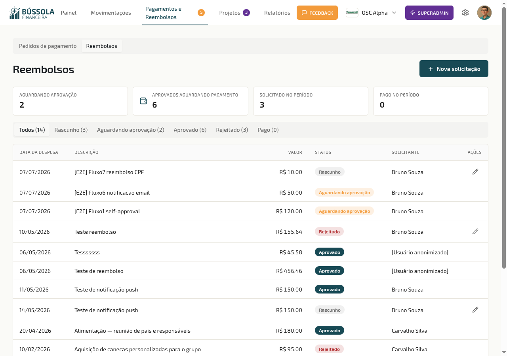](assets/screenshots/manual-05-reembolsos-lista.png)
*Lista de reembolsos — v0.10 (beta)*

A lista mostra todos os reembolsos da organização (Presidente e Tesoureiro veem todos; Voluntários veem apenas os próprios).

**Colunas:** Data da despesa, Descrição, Valor, Status, Solicitante, Ações.

**Status possíveis:**
- ⬜ **Rascunho** — salvo mas não enviado para aprovação
- 🟡 **Aguardando aprovação** — enviado, aguardando votação dos aprovadores
- 🟢 **Aprovado** — aprovado, aguardando confirmação de pagamento pelo tesoureiro
- 🔴 **Rejeitado** — reprovado com motivo (pode ser reeditado e reenviado)
- 💙 **Pago** — pagamento confirmado pelo tesoureiro

Nas linhas com status "Aguardando aprovação", os aprovadores elegíveis (Presidente e Tesoureiro) veem os botões ✓ **Aprovar** e ✕ **Rejeitar** diretamente na lista.

### Detalhe de um reembolso — Aguardando aprovação

[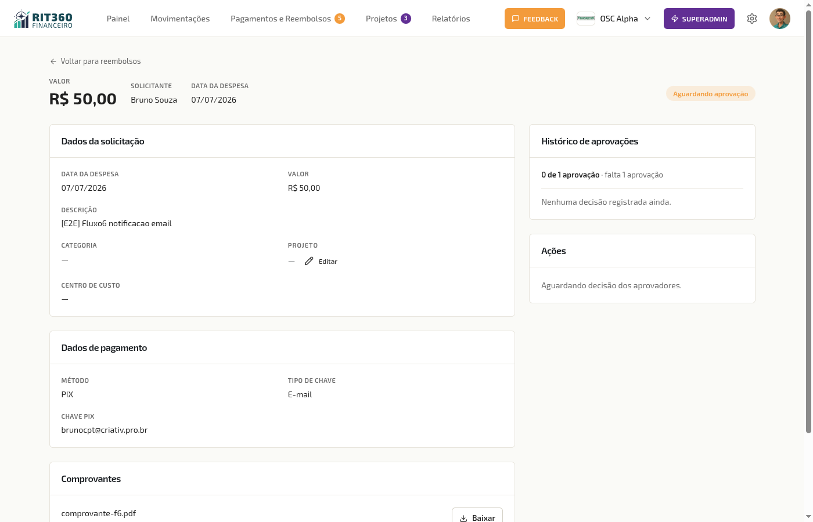](assets/screenshots/manual-06-reembolso-aguardando.png)
*Detalhe de reembolso aguardando aprovação — v0.10 (beta)*

Clique em qualquer linha para abrir o detalhe. Você verá:

- **Valor**, **Solicitante** e **Data da despesa** no topo
- **Status** em destaque no canto superior direito
- **Dados da solicitação**: descrição, categoria, projeto, centro de custo
- **Dados de pagamento**: método (PIX ou TED) e chave/conta bancária *(visível apenas para aprovadores e tesoureiro)*
- **Comprovantes**: documentos anexados pelo solicitante
- **Histórico de aprovações**: registro de todos os votos com nome, papel e data
- **Ações**: botões Aprovar / Rejeitar (para aprovadores) ou mensagem de status

### Detalhe de um reembolso — Rejeitado

[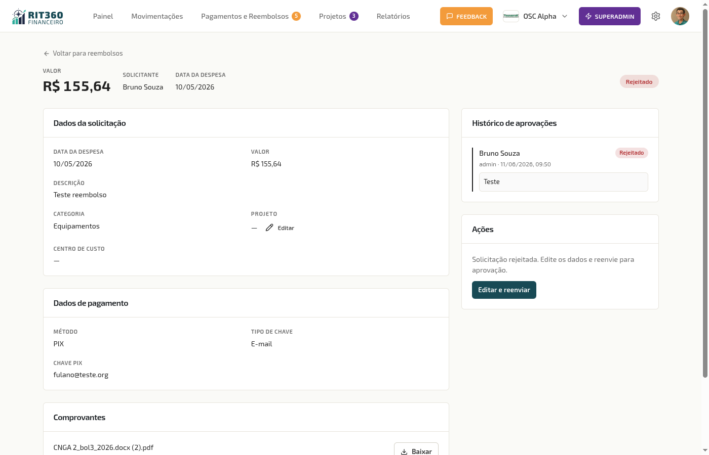](assets/screenshots/manual-06b-reembolso-rejeitado.png)
*Detalhe de reembolso rejeitado, com motivo e histórico — v0.10 (beta)*

Quando rejeitado, o detalhe exibe o motivo em destaque no topo. O solicitante pode clicar em **Editar e reenviar** para corrigir e resubmeter a solicitação.

### Detalhe de um reembolso — Aprovado

[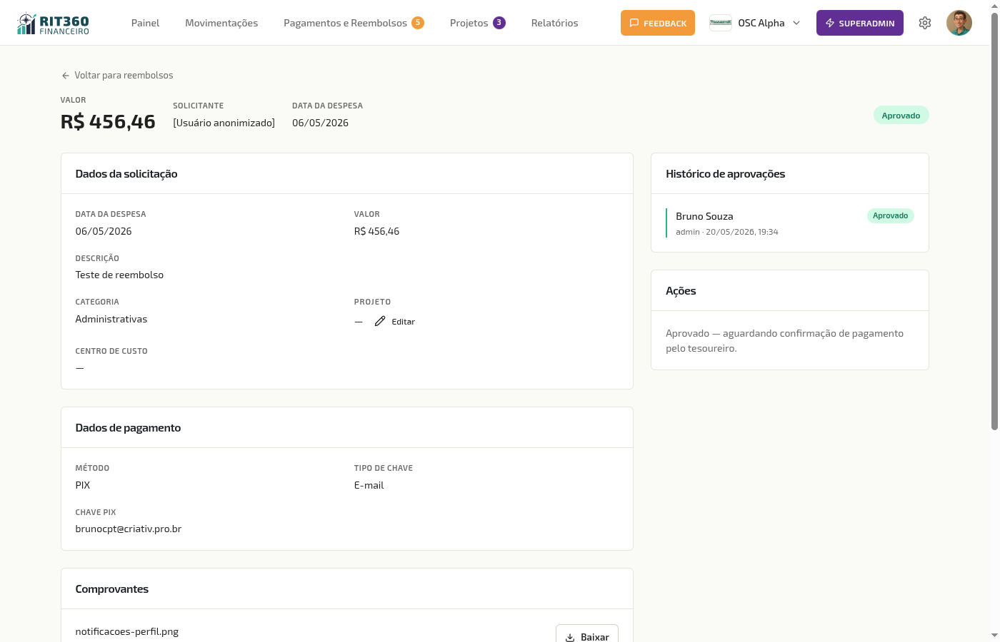](assets/screenshots/manual-06c-reembolso-aprovado.png)
*Detalhe de reembolso aprovado — v0.10 (beta)*

Quando aprovado, o painel de Ações mostra: **"Aprovado — aguardando confirmação de pagamento pelo tesoureiro."**

O tesoureiro confirma o pagamento diretamente na movimentação financeira gerada automaticamente em **Movimentações** (ícone "Marcar como pago").

### Nova solicitação de reembolso

[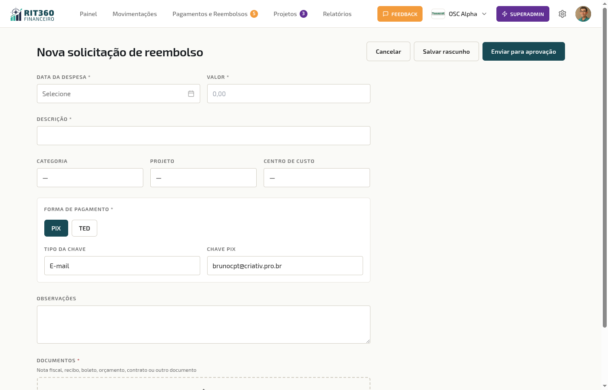](assets/screenshots/manual-06d-novo-reembolso.png)
*Formulário de nova solicitação de reembolso — v0.10 (beta)*

Clique em **+ Nova solicitação** para abrir o formulário.

**Campos obrigatórios:**
- **Data da despesa**
- **Valor**
- **Descrição** (o que foi comprado e para qual atividade)
- **Forma de pagamento**: PIX ou TED, com dados bancários para recebimento
- **Documentos**: nota fiscal, recibo ou comprovante da despesa

**Campos opcionais:** Categoria, Projeto, Centro de custo, Observações.

> 💡 Os dados de pagamento (chave PIX ou dados bancários) são preenchidos automaticamente se você configurou seu **Método de pagamento padrão** em **Configurações → Perfil**.

**Botões de ação:**
- **Salvar rascunho** — salva sem enviar; você pode editar e enviar depois
- **Enviar para aprovação** — envia para os aprovadores elegíveis da organização

---

## 6. Pedidos de pagamento

O módulo de **Pedidos de pagamento** permite solicitar formalmente que a organização realize um pagamento a um fornecedor, prestador de serviços ou para cobrir uma despesa institucional.

> Diferença em relação ao reembolso: no reembolso, o membro já pagou a despesa do próprio bolso. No pedido de pagamento, o dinheiro vai diretamente da conta da organização para o destinatário.

> Acesse pelo menu **Pagamentos e Reembolsos → aba Pedidos de pagamento**.

### Lista de pedidos de pagamento

[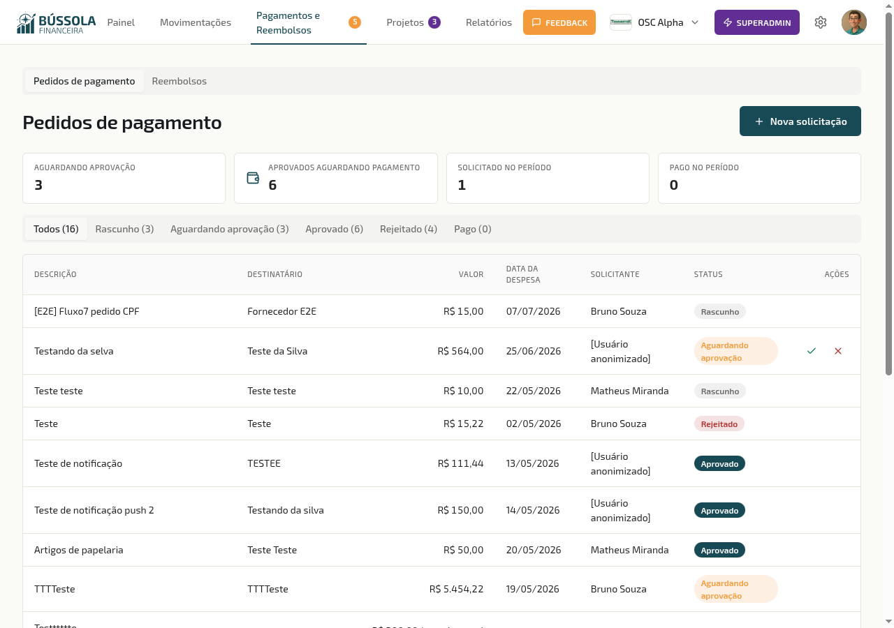](assets/screenshots/manual-07-pedidos-lista.png)
*Lista de pedidos de pagamento — v0.10 (beta)*

A lista exibe todos os pedidos com: Descrição, Destinatário, Valor, Data da despesa, Solicitante e Status.

Os **cards de resumo** no topo mostram, de acordo com seu papel:
- **Aguardando minha aprovação** — *Presidente e Tesoureiro*
- **Aprovados aguardando pagamento** — *Tesoureiro*
- **Solicitado no período** — *todos os papéis*

**Status possíveis:**
- ⬜ **Rascunho** — salvo sem enviar
- 🟡 **Aguardando aprovação** — enviado para aprovação
- 🟢 **Aprovado** — aprovado, aguardando pagamento pelo tesoureiro
- 🔴 **Rejeitado** — reprovado com motivo
- 💙 **Pago** — pagamento realizado e confirmado

### Detalhe de um pedido — Aguardando aprovação

[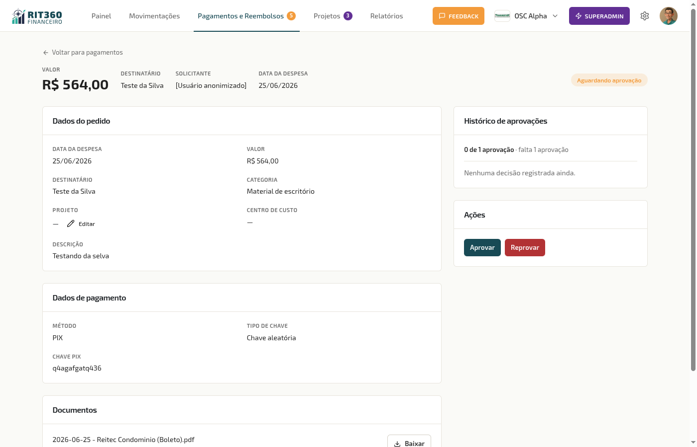](assets/screenshots/manual-08-pedido-aguardando.png)
*Detalhe de pedido aguardando aprovação — v0.10 (beta)*

O detalhe mostra:
- **Valor**, **Destinatário**, **Solicitante** e **Data da despesa** no topo
- **Dados do pedido**: descrição, categoria, projeto, centro de custo
- **Documentos**: orçamento, nota fiscal ou contrato
- **Histórico de aprovações**
- **Ações**: Aprovar / Reprovar *(para aprovadores elegíveis)*

> Os dados de pagamento do destinatário (PIX/TED/Boleto) são visíveis apenas para aprovadores e tesoureiro.

### Detalhe de um pedido — Rejeitado

[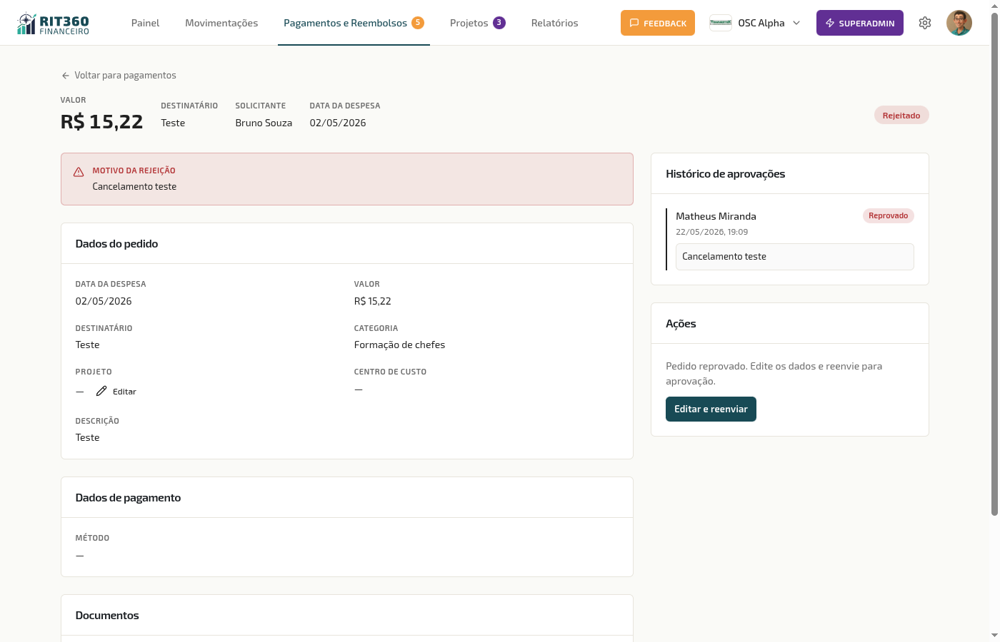](assets/screenshots/manual-08b-pedido-rejeitado.png)
*Detalhe de pedido rejeitado, com motivo de rejeição — v0.10 (beta)*

Quando rejeitado, o motivo aparece em destaque no topo. O solicitante pode editar e reenviar o pedido corrigido.

### Detalhe de um pedido — Aprovado

[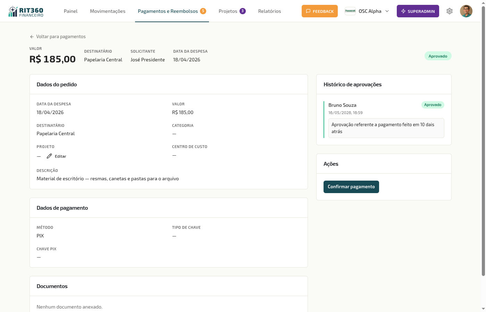](assets/screenshots/manual-08c-pedido-aprovado.png)
*Detalhe de pedido aprovado — v0.10 (beta)*

Quando aprovado, o painel de Ações exibe: **"Aprovado — aguardando confirmação de pagamento pelo tesoureiro."**

O tesoureiro confirma o pagamento pelo lançamento gerado automaticamente em **Movimentações**.

### Novo pedido de pagamento

[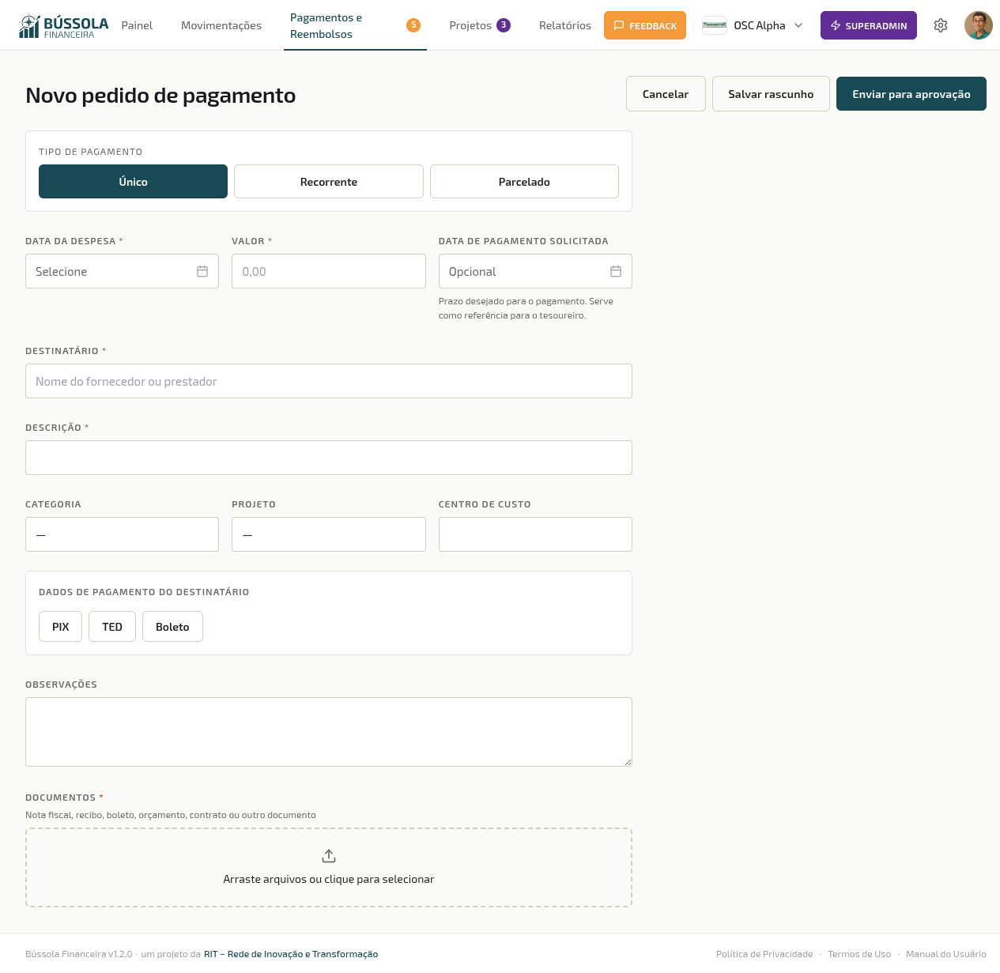](assets/screenshots/manual-08d-novo-pedido.png)
*Formulário de novo pedido de pagamento — v0.10 (beta)*

Clique em **+ Nova solicitação** para abrir o formulário.

**Campos obrigatórios:**
- **Data da despesa** — data prevista ou da nota fiscal
- **Valor**
- **Destinatário** — nome do fornecedor ou prestador de serviços
- **Descrição** — o que está sendo pago e para qual finalidade
- **Dados de pagamento do destinatário**: PIX, TED ou Boleto

**Campos opcionais:** Categoria, Projeto, Centro de custo, Observações, Documentos (orçamento, nota, contrato).

> Diferença do reembolso: aqui os dados de pagamento são do **destinatário** (fornecedor), não do solicitante. Não há pré-preenchimento automático.

**Botões de ação:**
- **Salvar rascunho** — salva sem enviar
- **Enviar para aprovação** — envia para aprovação

---

## 7. Configurações

O menu **Configurações** dá acesso às preferências pessoais e, para administradores, às configurações da organização.

[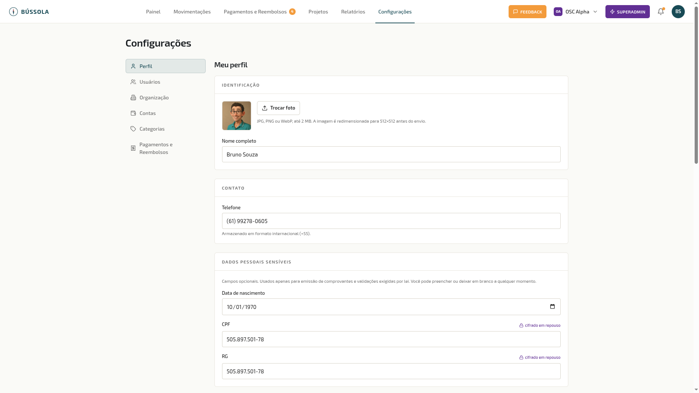](assets/screenshots/manual-09-config-perfil.png)
*Configurações — Perfil pessoal — v0.10 (beta)*

### Perfil pessoal

Disponível para todos os usuários. Seções:

**Identificação**
- Foto de perfil (JPG, PNG ou WebP, até 2 MB)
- Nome completo

**Contato**
- Telefone (formato internacional)

**Dados pessoais sensíveis** *(opcionais)*
- Data de nascimento, CPF e RG — armazenados de forma cifrada; usados apenas para emissão de comprovantes quando exigido por lei

**Ações de conta**
- Encerrar sessões ativas em outros dispositivos
- Solicitar exclusão de dados (LGPD)
- Alterar senha

**Notificações**
- Número de WhatsApp para receber alertas
- Telegram (vinculação via @BussolaBot)

**Dados para reembolso** *(muito útil!)*
- Configure sua chave PIX ou dados bancários aqui — o formulário de nova solicitação de reembolso vai preencher automaticamente esses dados, poupando tempo.

---

### Usuários *(admin)*

[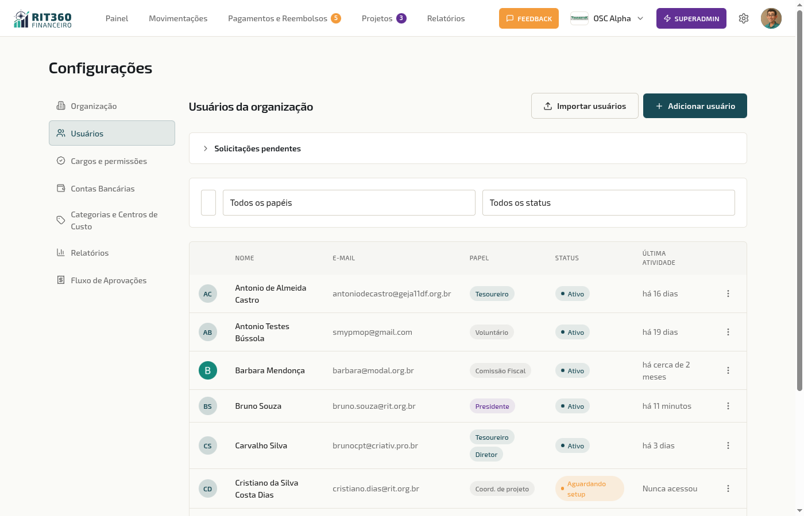](assets/screenshots/manual-09b-config-usuarios.png)
*Configurações — Gerenciamento de usuários — v0.10 (beta)*

> Disponível apenas para o papel **Presidente (admin)**.

Mostra todos os membros da organização com nome, e-mail, papel, status e última atividade.

**Ações disponíveis por membro:**
- Alterar papel
- Desativar / reativar acesso
- Cancelar convite pendente
- Reenviar e-mail de configuração de conta

**Adicionar usuário:** clique em **+ Adicionar usuário**, informe o e-mail e o papel. O sistema envia automaticamente um e-mail de convite com o link de primeiro acesso.

---

### Organização *(admin)*

[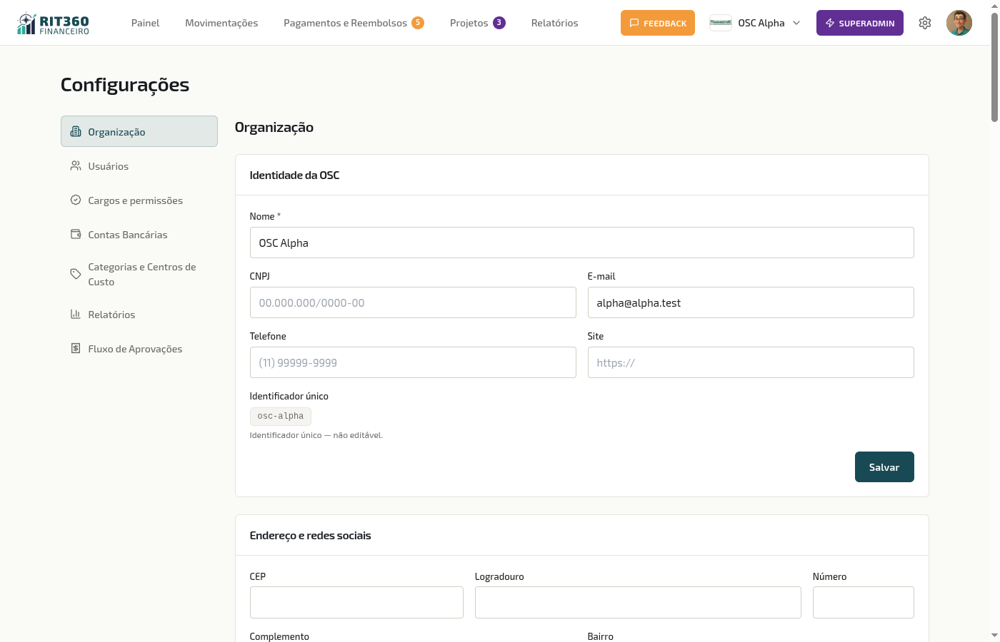](assets/screenshots/manual-09c-config-organizacao.png)
*Configurações — Dados da organização — v0.10 (beta)*

> Disponível apenas para o papel **Presidente (admin)**.

Seções:
- **Identidade da OSC**: nome, CNPJ, e-mail, telefone, site
- **Endereço e redes sociais**
- **Integrações**: Google Drive, WhatsApp Business, Telegram *(configurações em implantação)*

---

### Contas financeiras *(admin)*

[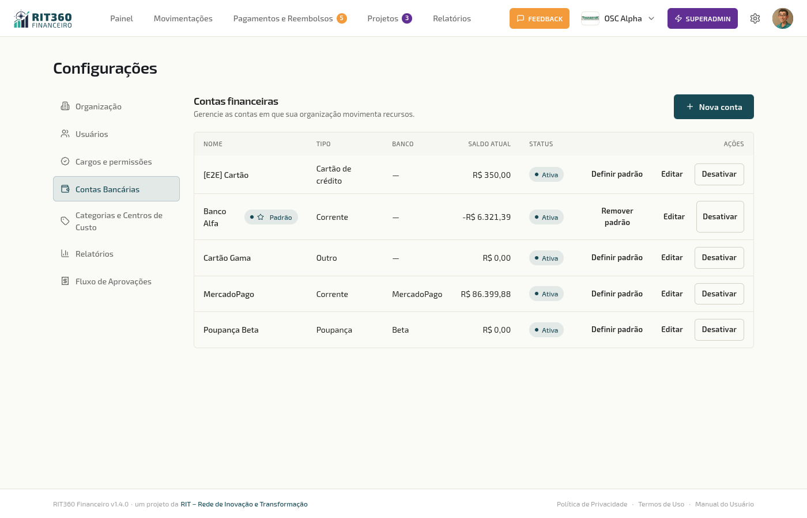](assets/screenshots/manual-09d-config-contas.png)
*Configurações — Contas financeiras — v0.10 (beta)*

> Disponível apenas para o papel **Presidente (admin)**.

Lista as contas bancárias e financeiras da organização com saldo atual, tipo e status.

**Tipos de conta:** Corrente, Poupança, Investimento, Dinheiro, Cartão de crédito, Cartão de débito, Outro.

**Ações:** Editar dados da conta, Desativar/reativar conta.

**Nova conta:** clique em **+ Nova conta** para adicionar. Preencha nome, tipo, banco, saldo inicial e data de abertura.

> ⚠️ Contas com movimentações registradas não podem ser excluídas — apenas desativadas.

---

### Categorias e centros de custo *(admin)*

[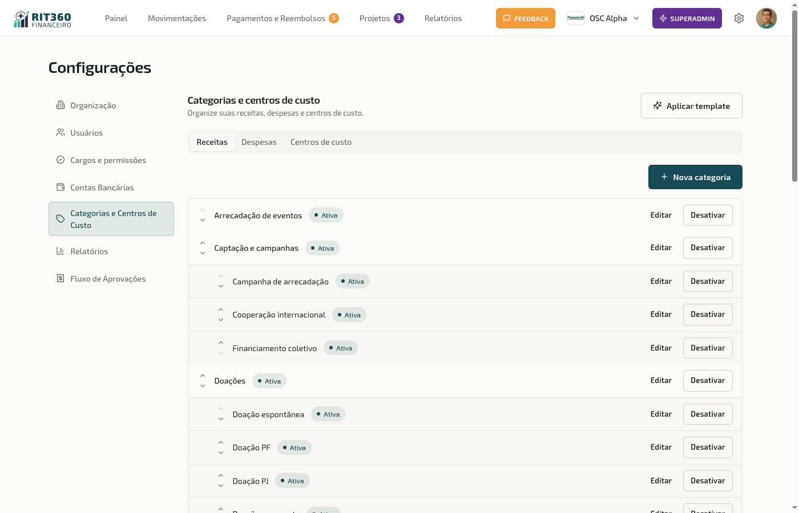](assets/screenshots/manual-09e-config-categorias.png)
*Configurações — Categorias — v0.10 (beta)*

> Disponível apenas para o papel **Presidente (admin)**.

Organize as categorias de receita, despesa e centros de custo da sua organização.

**Abas:** Receitas | Despesas | Centros de custo

Para começar rapidamente, clique em **Aplicar template** e selecione um dos modelos prontos (ex: "Padrão Grupo Escoteiro 2026") para importar categorias pré-configuradas.

---

### Pagamentos e Reembolsos *(admin)*

[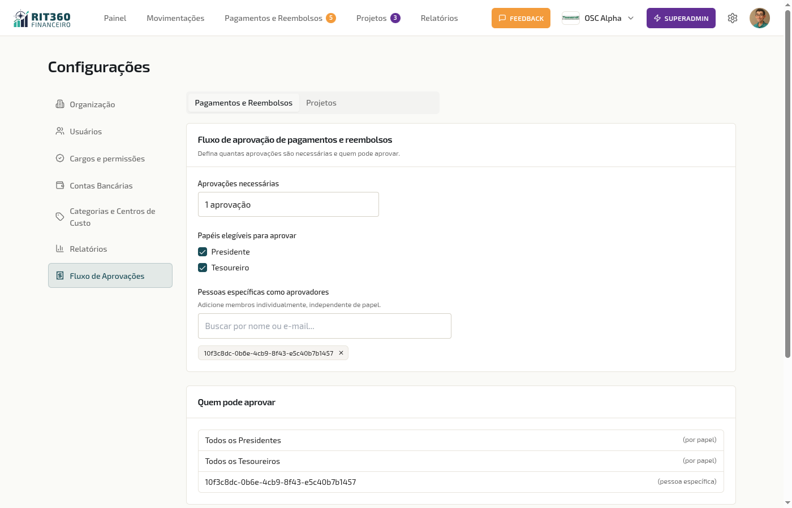](assets/screenshots/manual-09f-config-workflow.png)
*Configurações — Workflow de aprovação — v0.10 (beta)*

> Disponível apenas para o papel **Presidente (admin)**.

Configure quem pode aprovar reembolsos e pedidos de pagamento:

- **Aprovações necessárias**: quantos votos são exigidos (1 ou 2)
- **Papéis elegíveis para aprovar**: Presidente, Tesoureiro
- **Pessoas específicas**: adicione aprovadores individuais independente do papel

A seção **Quem pode solicitar pagamentos** define quais papéis podem criar pedidos de pagamento (padrão: Presidente, Tesoureiro, Coordenador de Projeto).

---

## 8. Papéis e permissões

O Bússola tem quatro papéis de usuário dentro de uma organização:

| Papel | O que pode fazer |
|---|---|
| **Presidente** | Tudo: aprovar reembolsos e pedidos, gerenciar usuários, configurar a organização, lançar movimentações |
| **Tesoureiro** | Lançar movimentações, aprovar reembolsos e pedidos, confirmar pagamentos |
| **Coordenador de Projeto** | Solicitar reembolsos e pedidos de pagamento, ver movimentações |
| **Voluntário** | Solicitar reembolsos (apenas os próprios), ver o painel |

**Regras importantes:**
- Voluntários não podem solicitar pedidos de pagamento (apenas reembolsos)
- Voluntários não veem os dados de pagamento (PIX/TED/conta bancária) dos outros membros nos reembolsos
- Somente administradores (Presidente) acessam as configurações de organização, usuários, contas e categorias
- Aprovadores não podem aprovar suas próprias solicitações

---

## 9. Projetos e Relatórios

[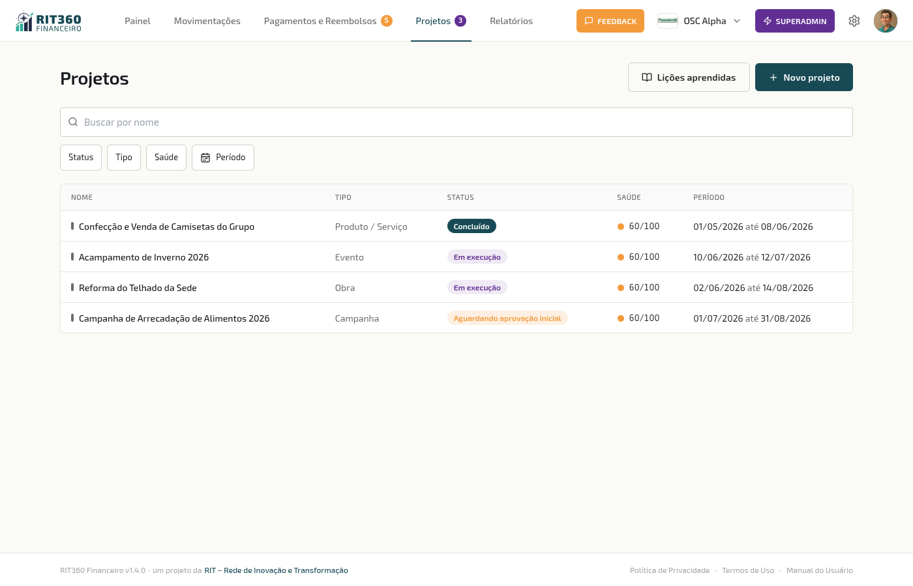](assets/screenshots/manual-10-projetos.png)
*Módulo Projetos — v0.10 (beta)*

Os módulos de **Projetos** e **Relatórios** estão em construção e estarão disponíveis em breve.

**Projetos** permitirá vincular movimentações, reembolsos e pedidos de pagamento a projetos específicos da organização (campanhas, eventos, atividades), facilitando a prestação de contas por projeto.

**Relatórios** trará análises financeiras consolidadas, gráficos de evolução e relatórios prontos para prestação de contas.

---

## 10. Perguntas frequentes

**Não recebi o e-mail de convite. O que faço?**
Peça ao administrador da sua organização que reenvie o convite pela tela de Usuários (menu Configurações → Usuários → ações do seu nome → Reenviar convite).

**Esqueci minha senha. Como redefino?**
Na tela de login, clique em **Esqueceu a senha?** e siga as instruções enviadas por e-mail.

**Posso usar o mesmo e-mail em mais de uma organização?**
Sim. Sua conta é única, mas você pode ser membro de múltiplas organizações. Use o seletor de organização no topo da tela para alternar entre elas.

**Meu reembolso foi rejeitado. Posso reenviar?**
Sim. Abra o detalhe do reembolso rejeitado, clique em **Editar e reenviar**, corrija as informações ou substitua os comprovantes e envie novamente.

**O sistema registrou minha despesa com data errada. Posso corrigir?**
Sim, desde que o lançamento ainda esteja com status **Pendente** ou **Atrasado**. Clique em **Editar** no detalhe da movimentação para corrigir.

**Minha conta bancária sumiu da lista. O que aconteceu?**
Contas podem ser desativadas por um administrador. Verifique com o responsável. Contas desativadas não aparecem nos filtros e formulários, mas as movimentações históricas são preservadas.

**Posso exportar os lançamentos?**
Sim. Na lista de Movimentações, clique em **Exportar** e escolha PDF ou Excel. A exportação inclui os filtros ativos no momento.

**O que acontece quando um reembolso é aprovado?**
O sistema gera automaticamente uma movimentação financeira de despesa vinculada ao reembolso. O tesoureiro confirma o pagamento marcando essa movimentação como "Pago" na tela de Movimentações.

**Onde configuro minha chave PIX para receber reembolsos?**
Em **Configurações → Perfil**, na seção **Dados para reembolso**. Configure lá uma vez; o formulário de nova solicitação de reembolso vai preencher automaticamente na próxima vez.

**Tenho uma sugestão ou encontrei um erro. Como informo?**
Use o botão **💬 Feedback** no menu superior. Ele está disponível para todos os usuários e envia sua mensagem diretamente para a equipe da RIT.

---

## 11. Histórico de versões

Acompanhe o que foi adicionado, corrigido e melhorado em cada versão do Bússola Financeira.

[Ver Changelog completo](changelog)

---

*Bússola Financeira v0.10 (beta) · Uma iniciativa da [RIT — Rede de Inovação e Transformação](https://rit.org.br) · [dpo@rit.org.br](mailto:dpo@rit.org.br)*
